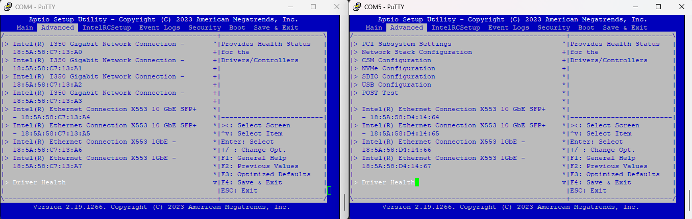
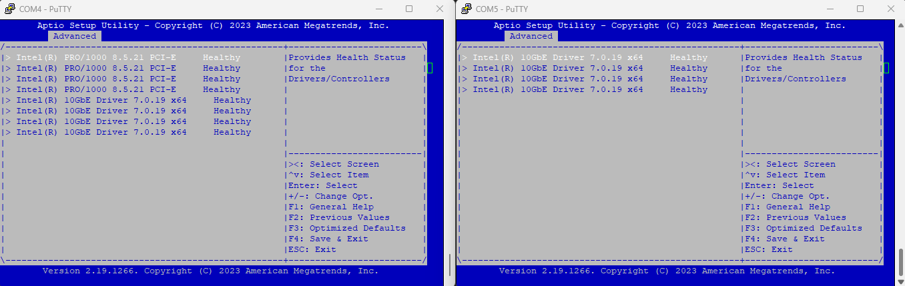

The differences in the BIOS settings for the 640s I have is in the Advanced tab.  The one on the left is the unit that has the NICs available.  There does not appear to be anything in the BIOS that you can change get the NICs back.

1. Advanced tab
  - Missing all the I350 NICs at the bottom of the page
    - 
  - The same can be seen in the Driver Health
    - 
